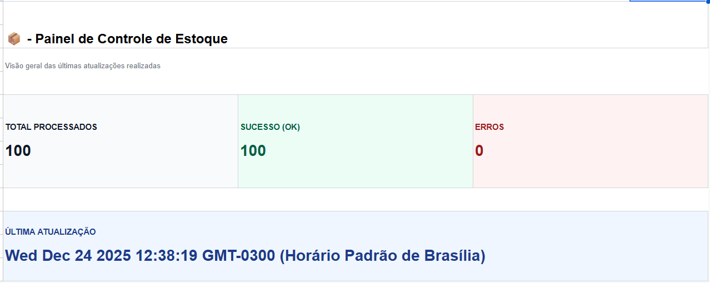
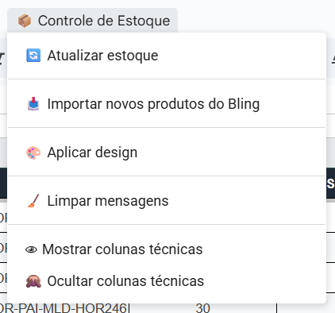
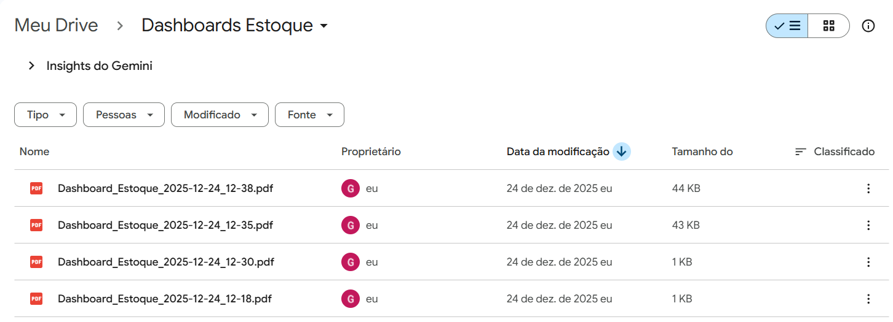

# Integração Bling + Google Sheets

Projeto em Google Apps Script com JavaScript e API para controle e sincronização de estoque com o Bling ERP.

## Funcionalidades

- Atualização de estoque no Bling via Google Sheets
- Importação/Sincronização automática de produtos
- Dashboard visual automatizado
- Exportação do dashboard em PDF para o Google Drive
- Menu personalizado no Google Sheets
- Relatórios de atualização

## 📊 Dashboard de Estoque

O sistema gera automaticamente um dashboard visual ao final da atualização do estoque, consolidando informações essenciais para tomada de decisão.

## 🧭 Menu Personalizado

A planilha conta com um menu exclusivo no Google Sheets, permitindo executar ações críticas sem acessar o código.

## 📄 Exportação Automática em PDF

Após a atualização do estoque, o dashboard é exportado automaticamente em PDF e salvo em uma pasta dedicada no Google Drive.

## Tecnologias

- Google Apps Script
- JavaScript
- Google Sheets
- Bling API v3
- Google Drive API

## Como funciona

O Bling atua como fonte da verdade do estoque.
A planilha é sincronizada automaticamente a partir das APIs oficiais.
Ao ser gerado uma atualização de estoque pela planilha é gerado um relatório e enviado automaticamente em PDF para o Google Drive.

## Segurança

Credenciais sensíveis não fazem parte do repositório.
Utilize Script Properties para configuração.

